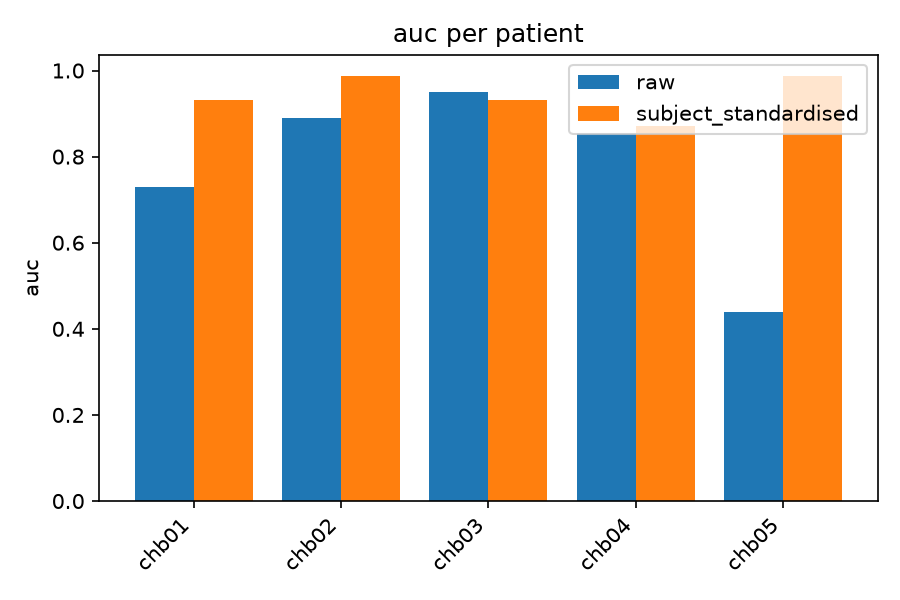

# Baseline seizure-detection report (Milestone 1)

> **Status: DRAFT.** The numbers, per-patient plots and observations below come from a
> **synthetic placeholder run** (`tests.fixtures.synth_signals.make_synthetic_project`,
> 6 fake patients, `--tuning fixed`), generated to prove the report structure end to end
> and to show what "done" looks like. They are **not real results** and must be replaced
> before this report is final. See "Regenerating this report" at the bottom.
>
> In fact, the placeholder numbers below are a textbook example of README Section 12.1's
> own warning: *"if any LOSO result is near-perfect (for example AUC above 0.98 for most
> patients), treat it as a bug and investigate before reporting."* Every AUC here is ~1.0
> because the synthetic data is small and easy to separate — not because the pipeline is
> unusually good. Do not draw any performance conclusion from this draft.

## 1. Method summary

Leave-one-subject-out (LOSO) evaluation of window-level seizure detection on the CHB-MIT
scalp EEG cohort, comparing two classifiers (linear-kernel-free RBF SVM, Random Forest) across
two arms:

- **`raw`** — features used as extracted, no per-patient adjustment.
- **`subject_standardised`** — each patient's own first ~10 minutes of seizure-free
  ("calibration") windows are used to z-score that patient's features before training/scoring;
  every other patient's fold uses its own calibration statistics independently. This is a
  cheap, per-patient sanity baseline: any more sophisticated adaptive method proposed later
  has to beat it, not just beat the unstandardised `raw` arm.

Every held-out patient's calibration windows are excluded from scoring in **both** arms
(they remain in *other* patients' training folds as ordinary labelled interictal data). Class
imbalance is handled by weighting (`class_weight="balanced"` / `"balanced_subsample"`) plus a
capped, ratio-controlled subsample of interictal training windows — never by resampling the
held-out patient, whose test set always reflects its natural class balance.

## 2. Results table

Per README Contract C7, `results/tables/summary_all.csv` (mean, SD, median across patients,
`n_patients` = how many patients actually contributed a non-NaN value for that metric):

| Arm | Model | Sensitivity | Specificity | F1 | AUC | FA/hour | n_patients |
|---|---|---|---|---|---|---|---|
| raw | svm | 1.000 ± 0.000 | 0.999 ± 0.003 | 0.993 ± 0.018 | 1.000 ± 0.000 | 1.96 ± 4.80 | 6 |
| raw | rf | 0.952 ± 0.117 | 1.000 ± 0.000 | 0.972 ± 0.068 | 1.000 ± 0.000 | 0.00 ± 0.00 | 6 |
| subject_standardised | svm | 1.000 ± 0.000 | 1.000 ± 0.000 | 1.000 ± 0.000 | 1.000 ± 0.000 | 0.00 ± 0.00 | 6 |
| subject_standardised | rf | 1.000 ± 0.000 | 1.000 ± 0.000 | 1.000 ± 0.000 | 1.000 ± 0.000 | 0.00 ± 0.00 | 6 |

*(± is the sample standard deviation across patients, not a confidence interval. Median is
in `summary_all.csv` alongside the mean but omitted from this table for space; pull it in if
the mean and median disagree noticeably, which is itself worth a comment — see below.)*

**On real data**, this table is very unlikely to show every cell at 1.000 — expect `raw` to
be noticeably worse than `subject_standardised` on at least sensitivity or AUC (see the
Step 11/12 test suite, where a strong synthetic `patient_shift` reliably produces a
raw-vs-standardised AUC gap of 0.1–0.3). If the real run instead lands close to this
draft's all-1.000 pattern, treat that as the same red flag the placeholder banner above
describes, not as a good result.

## 3. Per-patient plots

`scripts/06_make_report.py` writes one grouped bar chart per model per metric to
`results/figures/`:

- `sensitivity_per_patient_{model}.png`
- `specificity_per_patient_{model}.png`
- `auc_per_patient_{model}.png`

for `model` in `svm`, `rf` — six PNGs total, each with one bar per arm (`raw` vs
`subject_standardised`) per patient, so the two arms can be compared patient-by-patient at a
glance. Embed the real ones here once generated, e.g.:

```markdown

```

## 4. Observations about between-patient variation

*(Template — replace with what the real per-patient tables actually show.)*

In the placeholder run, `chb06` is the one patient with any false positives at all under
`raw`/svm (11.76 FA/hour vs 0.00 everywhere else), and it disappears entirely under
`subject_standardised` — a worked (if exaggerated, since it's synthetic) example of exactly
what arm 1 is supposed to fix: a patient whose absolute feature levels sit differently from
the rest of the cohort gets penalised under `raw` and recovers once evaluated against its own
calibration baseline instead of everyone else's pooled scale.

On real data, look specifically for:

- **Which patients drag the mean down**, and whether it's the same one or two patients across
  both models (a model-specific weakness) or consistent across models (more likely a genuine
  property of that patient's recording — few seizures, unusual channel quality, etc.);
- **Whether `n_ictal` correlates with metric noise** — a patient with 1–2 seizures total will
  have a sensitivity of exactly 0%, 50% or 100%, nothing in between, which is a sample-size
  artefact, not necessarily a real difference in detectability (see Limitations, below);
- **Whether the `raw` vs `subject_standardised` gap is consistent across patients** or
  concentrated in a few — a uniform small gain suggests calibration is a mild across-the-board
  correction; a gain concentrated in one or two patients suggests those specific patients have
  unusual absolute feature levels the rest of the cohort doesn't share.

## 5. Limitations

- **`fa_per_hour` is not a clinical false-alarm rate.** It's `fp / (n_windows * step_s / 3600)`,
  computed only on the seizure-free data that was actually included in this cohort slice
  (`dataset.max_seizure_free_hours_per_patient` caps how much seizure-free data per patient is
  even considered). A clinical false-alarm rate would need continuous, uncapped recordings and
  event-level (not window-level) counting; this number is a same-data sanity check between arms
  and models, not a deployment-readiness figure.
- **Scoring is window-level, not event-level.** A single seizure that spans many overlapping
  windows contributes many `tp`/`fn` counts, not one. This inflates the apparent granularity of
  sensitivity relative to "did the system detect this seizure episode at all," which is the
  clinically relevant question and is not what these numbers answer.
- **Some patients have very few seizures**, so their per-patient sensitivity, specificity and
  F1 are noisy in the literal statistical sense: with `n_ictal` in the single digits, one
  misclassified window moves the metric by 10–50 percentage points. Treat any single patient's
  numbers with more caution than the cohort mean, and don't over-interpret the median/mean gap
  if `n_ictal` is small for the patients driving it.
- **Calibration windows are assumed seizure-free by construction, not verified as truly
  interictal.** `mark_calibration` marks the first ~10 minutes of *labelled-interictal* windows
  before each patient's first seizure in this dataset's annotations. It does not (and cannot,
  from labels alone) rule out sub-clinical activity, an unannotated event, or a genuinely
  atypical "resting" state for that patient. In a real deployment, the calibration period would
  need to be clinically confirmed seizure-free by a human, not just inferred from the same
  annotation file the labels come from.

## 6. Regenerating this report

```bash
# Real slice, then full cohort (see README Section 12.1)
python scripts/05_run_baseline.py --tuning fixed --max-patients 3   # fast sanity pass first
python scripts/06_make_report.py
# then, once that looks sane:
python scripts/05_run_baseline.py
python scripts/06_make_report.py
```

Before trusting the resulting numbers, run the Section 12.1 leakage review: confirm `patient`
(not `case`) is used for all grouping and no `chb21` appears in a `patient` column (L1); run
`label_shuffle_check` on the real features and confirm AUC lands near 0.5 (L8); and treat any
nearly-perfect per-patient AUC as a bug to investigate, not a result to report — exactly as
this draft's own placeholder numbers should be treated right now.