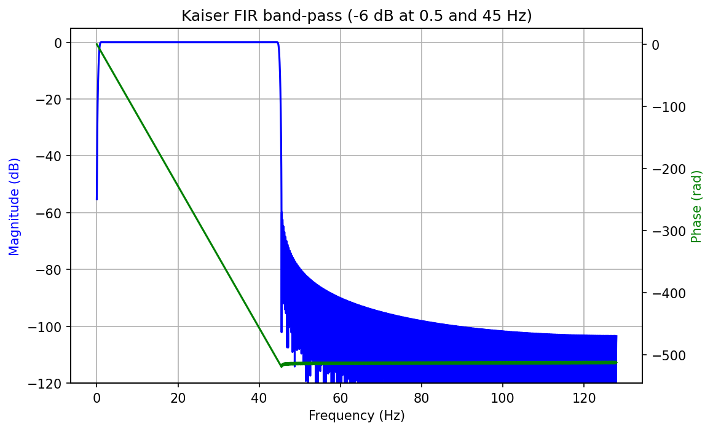

# Filter validation (Member A, Step 4)

Pre-processing = 60 Hz IIR notch (zero-phase `filtfilt`) followed by a 0.5-45 Hz linear-phase
Kaiser-window FIR band-pass. Everything below is *measured* by
`eegpipe.preprocessing.filters.filter_summary` (regenerate with `python -m eegpipe.preprocessing.filters`)
and asserted in `tests/test_filters.py`.

| Property | Value |
|---|---|
| Design | `scipy.signal.kaiserord(60 dB, 1 Hz transition)` -> `firwin`, beta = 5.65 |
| Length | **931 taps** (odd, linear phase) |
| Group delay | **1.82 s** (compensated: reflect-pad + trimmed `oaconvolve`, output aligned with input) |
| Gain at DC | -55.2 dB |
| Gain at 0.5 Hz / 45 Hz | **-6.0 dB / -6.0 dB** (cutoffs sit at the centre of the 1 Hz transition bands) |
| Gain at 1.0 Hz / 44.5 Hz | -0.01 dB / -0.01 dB |
| Passband ripple (2-43 Hz) | 0.003 dB |
| Stop-band above 45.5 Hz | <= -61 dB (worst case above 46 Hz: -65.8 dB) |
| 60 Hz | -112.5 dB (FIR alone), notch adds further attenuation |

## What this means for the data
* The flat passband is effectively **1.0-44.5 Hz**. Delta activity between 0.5 and 1 Hz is attenuated
  (down to -6 dB at 0.5 Hz). If that band matters, narrow `preprocessing.fir.transition_hz`
  (a 0.5 Hz transition needs roughly 1,860 taps and a 3.6 s delay). This is a config decision for
  all three members, not a bug.
* The 60 Hz notch is redundant given the 45 Hz low-pass; it is kept to match the synopsis.
* Cost for a wearable deployment: 931 taps and 1.8 s delay (offline processing is unaffected).

## Tests that back these numbers (`tests/test_filters.py`)
* numtaps 900-960, group delay ~1.82 s, -6 dB edges, ripple < 0.01 dB, stop-band < -58 dB;
* 10 Hz preserved (< 0.5 dB change), 60 Hz attenuated > 40 dB, DC offset rejected > 40 dB
  (relative check on the mean, and a no-op filter would fail it);
* zero time shift (cross-correlation peak at lag 0);
* shape/dtype preserved, 1-D and shorter-than-filter inputs work;
* the memory-saving per-channel implementation equals an all-channels-at-once reference (atol 1e-4).

## Not done (optional in the README)
* MATLAB `freqz` cross-check of the same coefficients.
* Butterworth IIR comparison.
